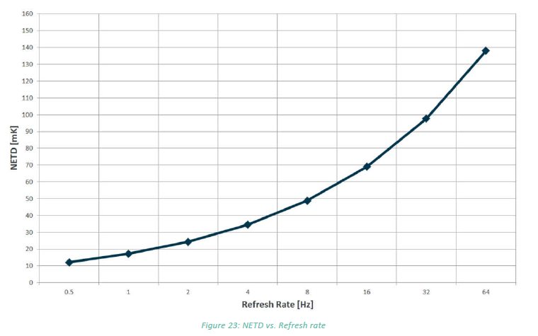
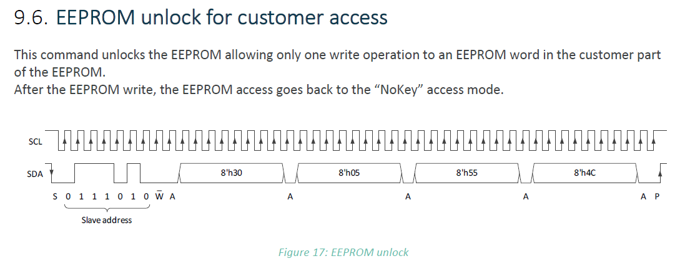
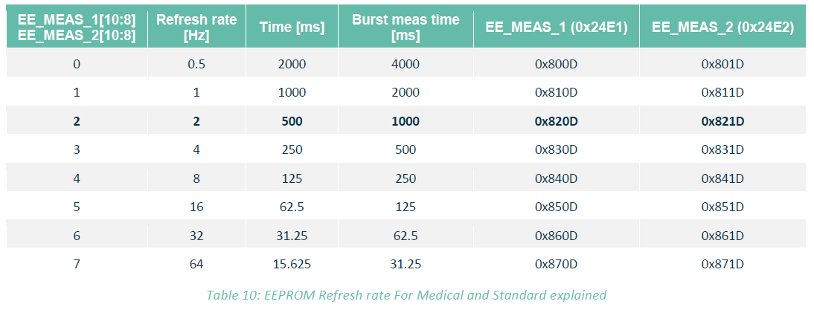

# Procedure to update the refresh rate in MLX90632

## Intro

The refresh rate defines the integration time the ADC gets alotted for it's acquisition of the signals.  
So the slower the refresh rate, the longer the integration time, and consequently the lower the noise on the reading will be.  
The refresh rate can be programmed between 64 Hz and 0.5Hz meaning that the integration time can be set in a ragne from 16ms to 2 seconds.

See datasheet for the noise impact: (https://melexis.com/mlx90632)


The default refresh rate is `2` meaning 2 Hz.

### Important Note 

The refresh rate setting resides in the EEPROM of the MLX90632. Therefore it is mandotory to select one refresh rate for your application and stick with it, as the re-programming will get you fast through the EEPROM erase/write cycles.


## I2C Stick

As of writing this document the website has no UI to support refresh update.  
However, the firmware does support it.
Meaning in the console one can sent a Configure Slave(cs) commands to set the refresh rate of the MLX90632, and after the update the sensor, as well as the plot will update according the selected refresh rate.

Below is a listing from the I2C Stick console where we take one MLX90632, starting with the default refresh rate, then I erase both 24E1 and 24E2 addresses, then I write the new content.

The `<-` sign indicates that what I entered in the console, while the `->` sign indicates the answer from the I2C Stick (and thus indirectly what MLX90632 answers on the I2C bus).

Let's start with listing the current configuration of the attached MLX90632:  
```
2024/10/30 14:01:28.454 <- cs:3A
2024/10/30 14:01:28.456 -> cs:3A:RAW=0
2024/10/30 14:01:28.458 -> cs:3A:SA=3A
2024/10/30 14:01:28.458 -> cs:3A:RR=2
2024/10/30 14:01:28.459 -> cs:3A:EM=1.000
2024/10/30 14:01:28.460 -> cs:3A:Ha=1.000
2024/10/30 14:01:28.461 -> cs:3A:Hb=0.000
2024/10/30 14:01:28.462 -> cs:3A:MODE=3(CONTINIOUS)
2024/10/30 14:01:28.462 -> cs:3A:MEAS_SELECT=0
2024/10/30 14:01:28.463 -> cs:3A:RO:MV_HEADER=TA,TO
2024/10/30 14:01:28.464 -> cs:3A:RO:MV_UNIT=DegC,DegC
2024/10/30 14:01:28.464 -> cs:3A:RO:MV_RES=128,128
2024/10/30 14:01:28.465 -> cs:3A:RO:EE_VERSION=0x8505
2024/10/30 14:01:28.466 -> cs:3A:RO:ACC=1(Medical)
2024/10/30 14:01:28.467 -> cs:3A:RO:I2C=0(3V3)
```

Abbreviations:  
- RR = Refresh Rate
- RO = Read Only
- EM = Emissivity
- ACC = Accuracy
- SA = 7-bit Slave Address (on the I2C bus)


Now, let's update the refresh rate

```
2024/10/30 14:03:35.217 <- +cs:3A:RR=4
2024/10/30 14:03:35.246 -> +cs:3A:RR=OK [mlx-EE]
```

And check again:

```
2024/10/30 14:04:10.650 <- cs:3A
2024/10/30 14:04:10.653 -> cs:3A:RAW=0
2024/10/30 14:04:10.654 -> cs:3A:SA=3A
2024/10/30 14:04:10.655 -> cs:3A:RR=4
2024/10/30 14:04:10.657 -> cs:3A:EM=1.000
2024/10/30 14:04:10.658 -> cs:3A:Ha=1.000
2024/10/30 14:04:10.659 -> cs:3A:Hb=0.000
2024/10/30 14:04:10.659 -> cs:3A:MODE=3(CONTINIOUS)
2024/10/30 14:04:10.660 -> cs:3A:MEAS_SELECT=0
2024/10/30 14:04:10.661 -> cs:3A:RO:MV_HEADER=TA,TO
2024/10/30 14:04:10.662 -> cs:3A:RO:MV_UNIT=DegC,DegC
2024/10/30 14:04:10.663 -> cs:3A:RO:MV_RES=128,128
2024/10/30 14:04:10.664 -> cs:3A:RO:EE_VERSION=0x8505
2024/10/30 14:04:10.665 -> cs:3A:RO:ACC=1(Medical)
2024/10/30 14:04:10.666 -> cs:3A:RO:I2C=0(3V3)
```

And indeed refresh rate is now set to `4`.  
You can now try to do it again after powercycling the MLX90632, it should still read `4`!


### I2C Stick demo firmware

See the function `_mlx90632_ee_write_refresh_rate`:  
https://github.com/melexis/i2c-stick/blob/main/i2c-stick-arduino/mlx90632_api.cpp#L335

And the function `_mlx90632_ee_write`:  
https://github.com/melexis/i2c-stick/blob/main/i2c-stick-arduino/mlx90632_api.cpp#L335


## The process at I2C level

First let's start with how the I2C Stick command for I2C looks like: (note this is I2C Stick firmware related; so not linked with MLX90632!)
```
2024/10/29 09:36:32.771 <- sos:i2c
2024/10/29 09:36:32.773 -> I2C command format:
2024/10/29 09:36:32.775 -> 1] WRITE         : 'i2c:<sa>:W<byte#0><byte#1>...' bytes in hex format
2024/10/29 09:36:32.776 -> 2] READ          : 'i2c:<sa>:R<amount of bytes to read>' amount in decimal format
2024/10/29 09:36:32.777 -> 3] ADDRESSED READ: 'i2c:<sa>:W<byte#0><byte#1>R<amount of bytes to read>...' bytes in hex format, amount in decimal
2024/10/29 09:36:32.778 -> <sa> Slave Address(7-bit) in hex format
```
==> So there are three I2C flavors of the I2C command, we will use only the first and the last one!


The next line will instruct the I2C master hardware on the I2C Stick to read 6 bytes from address 24E0 from slave 3A.
```
2024/10/29 09:14:45.118 <- i2c:3A:W24E0R06
2024/10/29 09:14:45.120 -> i2c:3A:24E0:R:070B820D821D:OK
```
So in the line above you can see that the first word at address 24E0 is 070B, then at 24E1 820D, and finally at 24E2 it reads 821D

Now we are entering the HALT mode, this is a mode where the MLX90632 goes to sleep mode immediately, the other modes would wait until the current conversion is finished. So we first read 2 bytes from 0x3001 ==> content is 0006.

```
2024/10/29 09:20:56.119 <- i2c:3A:W3001R02
2024/10/29 09:20:56.121 -> i2c:3A:3001:R:0006:OK
2024/10/29 09:21:27.133 <- i2c:3A:W30010000
2024/10/29 09:21:27.135 -> i2c:3A:30010000:OK
2024/10/29 09:21:36.502 <- i2c:3A:W3001R02
2024/10/29 09:21:36.504 -> i2c:3A:3001:R:0000:OK
```
As mode is bit 1 & 2, the mode was 3, and it turns out all other bits were at zero, so mode HALT(0) corresponds to writing zero to 3001 (REG_CONTROL), the last command reads again, and it is confirmed 3001 is now 0000.

The next command below, is `unlock`.  
See datasheet: (https://melexis.com/mlx90632)

It is equivalent of writing 554C to address 3005.
Note: you cannot read this to verify, and it will last only one write operation.

```
2024/10/29 09:23:29.773 <- i2c:3A:W3005554C     // unlock
2024/10/29 09:23:29.775 -> i2c:3A:3005554C:OK   // OK here means that there was an ACK seen by the master
```
First write zeros into 24E1
```
2024/10/29 09:23:41.697 <- i2c:3A:W24E10000       // erase 24E1
2024/10/29 09:23:41.700 -> i2c:3A:24E10000:OK
2024/10/29 09:23:44.886 <- i2c:3A:W24E0R06
2024/10/29 09:23:44.889 -> i2c:3A:24E0:R:070B0000821D:OK
```
Indeed, after a read 24E1 is now confirmed to be zero!
Next, again unlock, and erase 24E2

```
2024/10/29 09:24:01.901 <- i2c:3A:W3005554C      // unlock
2024/10/29 09:24:01.903 -> i2c:3A:3005554C:OK
2024/10/29 09:24:07.697 <- i2c:3A:W24E20000      // erase 24E2
2024/10/29 09:24:07.700 -> i2c:3A:24E20000:OK
2024/10/29 09:24:10.341 <- i2c:3A:W24E0R06       // read EEPROM
2024/10/29 09:24:10.343 -> i2c:3A:24E0:R:070B00000000:OK
```
Now both 24E1 and 24E2 are erased, let's reprogram, using refresh rate 4.
See datasheet:

Again we need to unlock the EEPROM, then write

```
2024/10/29 09:26:43.640 <- i2c:3A:W3005554C      // unlock EEPROM
2024/10/29 09:26:43.643 -> i2c:3A:3005554C:OK
2024/10/29 09:27:02.892 <- i2c:3A:W24E1840D      // write 24E1 = 840D
2024/10/29 09:27:02.894 -> i2c:3A:24E1840D:OK
2024/10/29 09:27:04.586 <- i2c:3A:W24E0R06       // check / read
2024/10/29 09:27:04.588 -> i2c:3A:24E0:R:070B840D0000:OK
2024/10/29 09:27:15.487 <- i2c:3A:W3005554C      // unlock EEPROM
2024/10/29 09:27:15.490 -> i2c:3A:3005554C:OK
2024/10/29 09:27:26.356 <- i2c:3A:W24E2841D      // write 24E2 = 841D
2024/10/29 09:27:26.358 -> i2c:3A:24E2841D:OK
2024/10/29 09:27:28.057 <- i2c:3A:W24E0R06       // check / read
2024/10/29 09:27:28.060 -> i2c:3A:24E0:R:070B840D841D:OK
```
Now 24E1 and 24E2 are programmed to the desired value.
Let's set the mode again to continuous, and check for a plausible temperature reading.
```
2024/10/29 09:27:41.615 <- i2c:3A:W3001R02
2024/10/29 09:27:41.618 -> i2c:3A:3001:R:0000:OK    // REG_CONTROL is still at zero!
2024/10/29 09:27:53.573 <- i2c:3A:W24E00006         // REG_CONTROL = 0006 or MODE = 3(CONTINUOUS)
2024/10/29 09:27:53.575 -> i2c:3A:24E00006:OK
2024/10/29 09:28:00.621 <- mv:3A                    // MV is the command 'Measure Value'
2024/10/29 09:28:00.905 -> mv:3A:00808431:22.89,20.95
```
TA=22.89 Deg C
TO=20.95 Deg C

Oooh! One last thing, we talked about three words EE_MEAS0/1/2 but you might also want to check that EE_MEAS3(24E3) is FFFF.

```
2024/10/29 10:00:07.281 <- i2c:3A:W24E0R08
2024/10/29 10:00:07.285 -> i2c:3A:24E0:R:070B840D841DFFFF:OK
```
